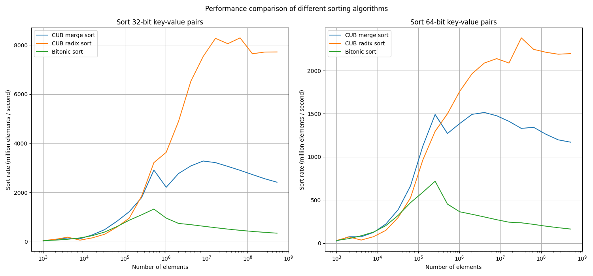
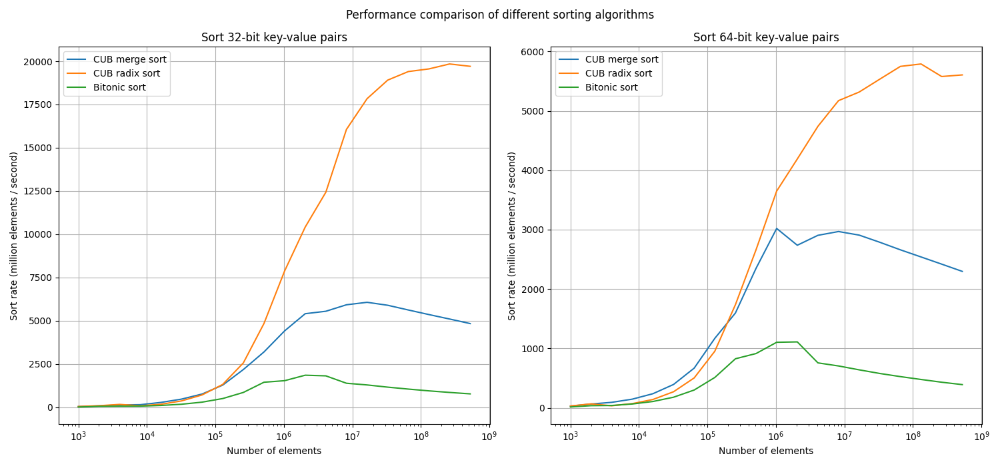
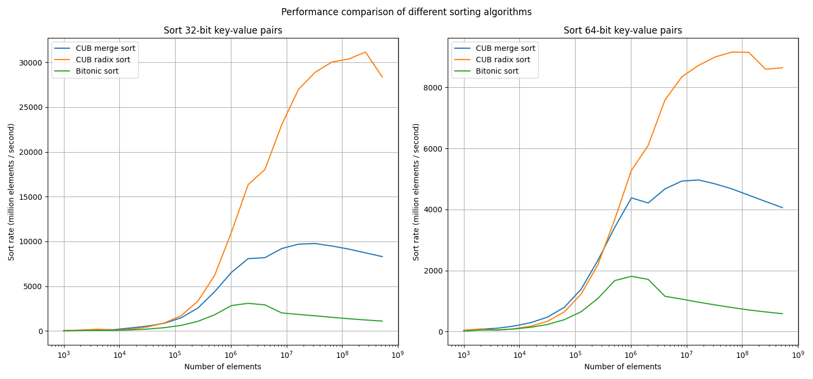

# CUDA Bitonic Sort

If you're looking for a in-place GPU comparison based sorting library that requires zero extra GPU memory, this might be what you're looking for. This repository contains a header-only implementation of bitonic sort. It is not the fastest sorting algorithm, but it might be good enough for your application in which GPU memory is more precious. 

The code is adapted from https://github.com/darkobozidar/sequential-vs-parallel-sort and is refactored to be concise and support arbitrary types and comparators. 

## Basic usage

```cpp
#include "bitonic_sort.h"

...

int* keys;
int* values;
int num_items;
...

// sort keys only
bitonic::sort(keys, num_items);

// sort key-value pairs
bitonic::sort_by_key(keys, values, num_items);
```

Since this algorithm operates in-place, we only support pointer types. So no fancy iterators. 

## Custom comparator

Example: sort pointers by their pointed-to value

```cpp
struct Compare {
  __device__ __host__ bool operator()(float* a, float* b) const {
    return *a < *b;
  }
};
...
float** data;
int N;
...
// here 0 means we're using the default stream
bitonic::sort(data, N, 0, Compare());
```

## Performance benchmark

We compared the performance of bitonic sort with state-of-the-art implementations of sorting algorithns in CUB on Tesla V100 and Tesla A100, and produced the graphs below. 

The main takeaway is that if performance is all you need, then CUB/thrust might be a better choice. Bitonic sort is only comparable to other sorting methods for small array sizes (< 10^5 elements). The advantage of bitonic sort is that, unlike CUB merge sort or radix sort, it does not require an extra copy of keys and values during the sorting process, which halves the memory usage. 


### V100 SXM2 32GB



### A100 SXM4 80GB



### H100 80GB


